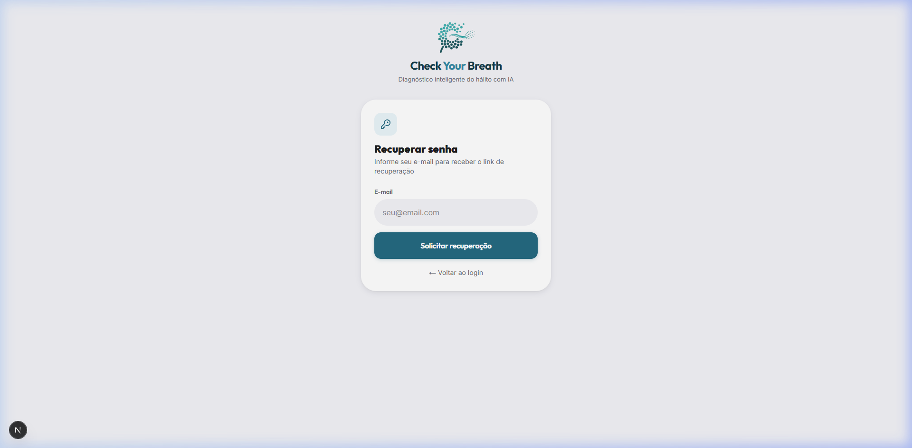
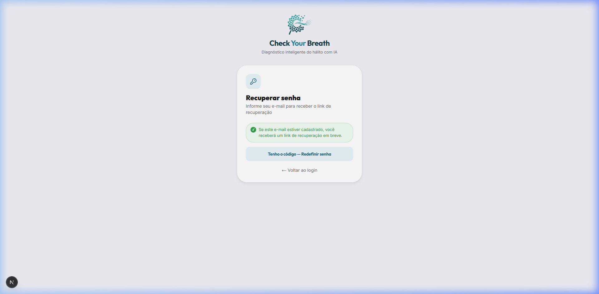
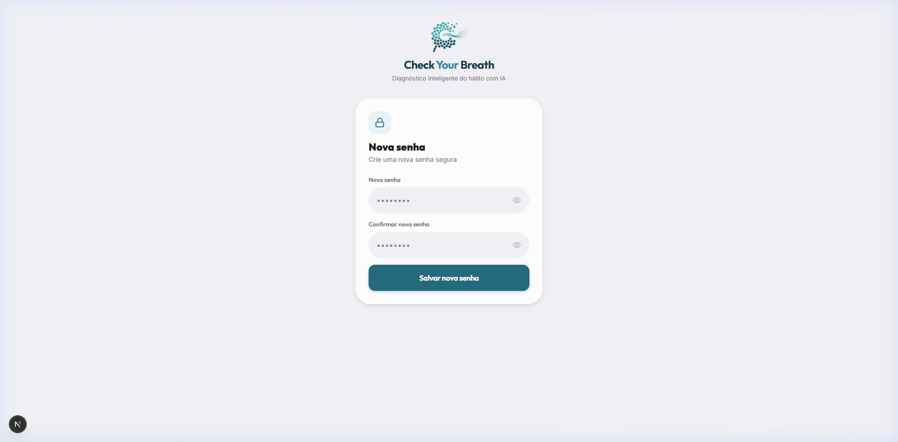
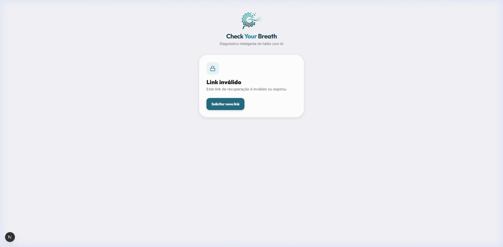

## Issue relacionada

Closes #

## O que foi feito

- **Alinhamento com FastAPI-Users**: Correção das rotas do BFF (`/api/auth/login` e auto-login pós-registro) para consumir `/api/v1/auth/jwt/login` e repasse de revogação de sessão em `/api/v1/auth/jwt/logout`.
- **Novas rotas BFF de recuperação de senha**: Criação de `app/api/auth/forgot-password` (retornando sempre status HTTP 202 por segurança contra enumeração de e-mails) e `app/api/auth/reset-password` (com tradução de erros de token/senha do backend).
- **Ampliação do `auth-service` e Client HTTP**: Adicionados métodos `esqueciSenha`, `redefinirSenha`, `obterUsuarioAtual` e `atualizarPerfil`, além do suporte ao método `patch` no `apiClient`.
- **Novos hooks e integração TanStack Query**: Implementados `useForgotPassword`, `useResetPassword`, `useCurrentUser` e `useUpdateProfile` com invalidação reativa de cache.
- **Integração das telas de Auth**: Telas `/esqueci-senha` e `/redefinir-senha` integradas com estados de loading, feedback ao usuário e validação de parâmetro `?token=` da URL.

## Tipo de mudança

- [x] `feature` — algo novo que o sistema não fazia antes
- [ ] `fix` — correção de comportamento que já existia e estava errado
- [ ] `chore` — não muda comportamento pra quem usa: config, deps, CI/CD, docs, formatação

## Evidência visual

1. **`/esqueci-senha` (Estado inicial do formulário)**:
   

2. **`/esqueci-senha` (Feedback de sucesso pós-solicitação)**:
   

3. **`/redefinir-senha?token=mock-token` (Com token de redefinição válido)**:
   

4. **`/redefinir-senha` (Sem token na URL - Estado de link inválido ou expirado)**:
   

## Como testar

1. **Modo Mock (padrão)**:
   - Acesse `/login` e realize login com `paciente@exemplo.com` / `123456` (ou cadastre novo usuário em `/registro`). Deve autenticar e redirecionar para a área correspondente.
   - Acesse `/esqueci-senha`, informe um e-mail e clique em "Solicitar recuperação". Deve exibir mensagem de sucesso.
   - Acesse `/redefinir-senha?token=mock-token`, preencha as duas senhas com no mínimo 8 caracteres e clique em "Salvar nova senha". Deve exibir sucesso e link para login.
   - Acesse `/redefinir-senha` sem token na URL. Deve exibir mensagem de link inválido/expirado.
2. **Testes Automatizados**:
   - Execute `npm test` para validar os 12 testes unitários e de integração de auth/sessão.
   - Execute `npm run build` para garantir a compilação do TypeScript e Turbopack.

## Checklist

- [x] Branch criada a partir de `develop` e nomeada como `<tipo>/<descrição-em-kebab-case>`
- [x] `npm run lint` passa
- [x] `npm run format:check` passa
- [x] `npm run test` passa
- [x] `npm run build` passa
- [x] Revisei meu próprio diff (sem `console.log`, código comentado ou arquivo solto)
- [x] Issue vinculada acima e evidência visual anexada (ou justificado que não se aplica)

## Observações pro time

- `AUTH_SECRET` permanece protegido por `server-only` no backend do Next.js e os tokens de sessão trafegam em cookie seguro `httpOnly` (`cyb_session`), mantendo a compatibilidade transparente entre `NEXT_PUBLIC_API_MOCKING=enabled` e backend FastAPI real.
